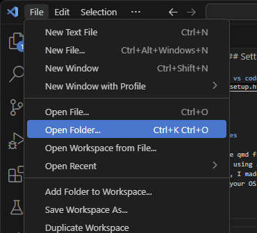
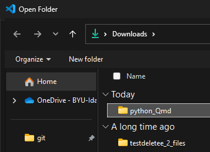
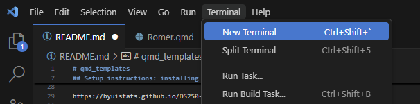
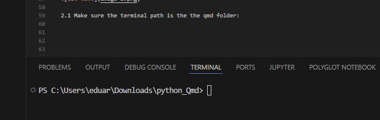
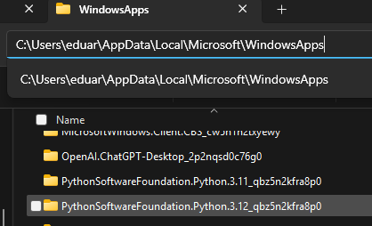

# 🌟 QMD Templates: Your Gateway to Seamless Coding

These files are intended to help you run `.qmd` files on any new device. This folder includes all necessary programs, files, and packages required to run the `.qmd` files properly.

---

## 🚀 Setup Instructions: Python, VS Code, and Quarto

Step-by-step instructions to install essential programs, adapted from the DS 250 course:

### 1. 🐍 Python:

Follow this detailed guide: [Python Setup](https://byuistats.github.io/DS250-Course/Setup/python_setup.html)

> **Note:** If you're having issues with Python, you might need to install it via the Microsoft Store (if your OS is Windows or includes Microsoft tools). You may also need to visit the data or computer science lab to connect the correct Python version for `.qmd` files. Python installation can be complicated.

### 2. 📚 Python Libraries:

Ensure you’ve got the basic libraries! [Python Libraries Setup](https://byuistats.github.io/DS250-Course/Setup/python_lib.html)

### 3. 💻 VS Code:

[VS Code Setup link and instructions](https://byuistats.github.io/DS250-Course/Setup/vs_code_setup.html)


### 4. 📊 Quarto:

Unleash the power of Quarto: [Quarto Setup](https://byuistats.github.io/DS250-Course/Setup/quarto_setup.html)

### 5. 🌐 Optional Tools (But Recommended!):

You can follow the instructions to set up Slack, GitHub, Git, and GitHub Copilot. These are commonly used in computer science and data science courses. You **do not** need a GitHub repository to run these `.qmd` files, but it's recommended to have one to save your work.

- **Heads-up:**  Connecting GitHub to your OS can get technical. Don’t hesitate to visit the data science lab for help!

Details here: [Optional Setup Instructions](https://byuistats.github.io/DS250-Course/setup.html)

---

## 🛠 Setting Up Your Environment for `.qmd` Files

**Golden Rule:** Download the `qmd_templates` folder and place it in your computer’s **C drive**. **Do not place it in a cloud-synced folder** (e.g., OneDrive, Google Drive).

> Example: Cloud-backed files cause issues where VS Code or RStudio won’t warn you that syncing is happening, leading you to think something else is broken. During rendering, the cloud client may lock the file, preventing VS Code or RStudio from accessing it. Authorization issues may also occur when cloud providers think the file is being accessed inappropriately by VS Code or RStudio.

---

### 💡 Why Environments Are Your Best Friend

Using a virtual environment (`.venv`) to run `.qmd` files is **highly recommended**. It helps you:

- Keep track of the packages/modules you're using.
- Avoid versioning issues when switching between courses or systems.
- Adapt more easily to updates in programming languages.

This guide was written using **Windows OS**, but it includes some commands for **Linux/macOS**. You may have to tweak a few commands depending on your OS—AI tools or your lab assistant can help.

---

## 📂 Setting Up the `qmd` Folder

### 1. Open the Folder in VS Code

Open the `qmd_templates` folder inside VS Code.

_Select the folder and click **Open**._

 | 

---

### 2. Open the Terminal in VS Code

Open a **new terminal** in VS Code.

 

Ensure the terminal path points to the `qmd_templates` folder.



---

### 3. Create a Virtual Environment

In the VS Code terminal, run the following command (for Windows PowerShell):

```powershell
py -m venv .venv
```

**If you have no problems with Python, move on to the next step.**

To ensure you install Python 3.12 (version use when the qmd files and requirements.txt file were tested/made/updated: ✅ _Built using Python 3.12.10), you can force the environment creation with:

```powershell
py -3.12 -m venv .venv
```

If you are unsure what python version you are using just make the env with this code: py -m venv .venv. This will create the .venv folder. Look for the `pyvenv.cfg` file in the .venv folder and open it, that file contains the python version use and path to the python version. You can navigate to the path in the file to see what version/s of python you have. In my case I have 3.12.10 and 3.11.10 installed. 



Now delete the .venv folder and create it again by forcing the correct python version. 
You can force the env creation with the python version you want using the following

```powershell
py -3.11 -m venv .venv
py -3.12 -m venv .venv
```

But for this case you will use this one: py -3.12 -m venv .venv. 


---

### 4. Activate the Environment

- **Windows PowerShell:**  
```bash
  .venv\Scripts\Activate.ps1
```

- **Windows CMD:** 
```bash
  .venv\Scripts\activate.bat
```

- **Linux/macOS:**  
```bash
  source .venv/bin/activate
```
  

> Make sure to activate the environment **every time** you open a new terminal or new session.

---

### 5. Install Packages from `requirements.txt`

Install all required packages using:

```bash
pip install -r requirements.txt
```

To **update** the `requirements.txt` with your current packages:

```bash
pip freeze > requirements.txt
```

> Keep this file updated—this makes it easy to transfer or share your setup across devices without having to install every package manually.

---

### 6. Install New Packages

To install a new Python package:

```bash
pip install module_name
```

> Example:  
> pip install pandas

---

✅ You should be all set. Just remember: **Activate your environment each time you open a new terminal and or session.**


